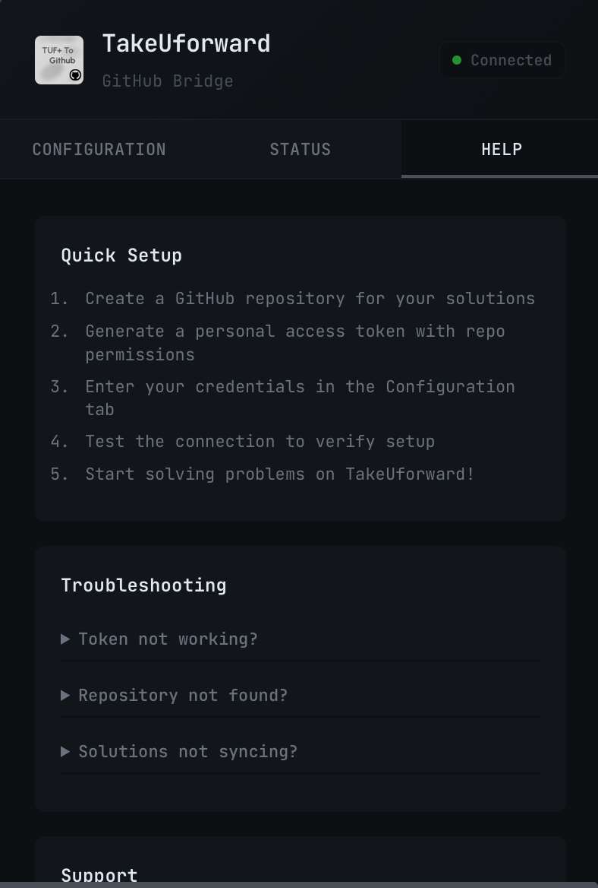

# This project will not be maintained anymore, but we have an alternative with ios/android app support with a lot more features than just basic github push (works not only tuf, but all platforms) : https://leet-feedback.vercel.app/

# TakeUforward To GitHub 

## <u>Installation</u>

### **Safari Users** 🧭

[▶️ Watch Safari Installation Video Tutorial](https://youtu.be/1dYI2wZfkJE?si=1Fk78wQvimInFo3Z)

> **Note:** I cannot disable the unverified app warning without paying Apple for a developer account, but the app is completely safe. You can build it yourself or check network logs to confirm the extension shows no suspicious activity.

1. Go to releases and download **`TakeUforwardToGithub.app.zip`**
2. **Extract** the zip file to your desired location
3. Install **TakeUforwardToGithub.app** - you'll see an _"unverified app"_ warning, click **"Done"**
4. Open **System Settings** and search for _"gatekeeper"_
5. Click the **"Open Anyway"** button
6. Open **Safari Settings** > **Advanced Settings** > Enable _"Show features for web developers"_
7. Navigate to **Safari Settings** > **Developer** > Check _"Allow unsigned extensions"_ (Even though I have signed it, blame apple)
8. Go to **Safari Settings** > **Extensions** > Enable the **TakeUforwardToGithub** extension
9. Open the TakeUforward website, click the extension icon, and select **"Always allow on this website"**

### **Chrome (and similar) Users** 🌐

1. Open **Browser settings** > **extensions** > _"load unpacked"_
2. Select the **unzipped repo directory**

## <u>Usage</u>

[▶️ Watch Demo Video](https://youtu.be/rukpCwCx3x8?si=DEQCMEOlA9BnMU1X)

1. **Open popup** and configure **user**, **repo**, and **token**
   > _Note: Make sure to check the "repo" scope while generating your token_ > 
2. **(Optional) Enable Notion tracking**: Toggle Notion integration and add your integration token from [notion.so/my-integrations](https://www.notion.so/my-integrations)
3. **Solve any problem** on the website
4. When you click "**Submit**", your solution will be **automatically pushed** to GitHub and Notion (if enabled)

## <u>Description</u>

I instantly missed leetsync and gfg to github after switching to tuf+. Decided to make a chrome extension but failed miserably. Over the rest of my first semester, i started learning webdev from chaicode, when i reached backend dev part, i
realized i now have some confidence in porting gfg to github extension to tuf+. Long story short, Both leetsync and gfg to github use their apis in some way (to fetch question and stuff) and tuf+ platform (being a paid one) doesn't have clear open apis.
So, the approach to this extension is completely different from leetsync and gfg to github. It fetches data from localstorage of tuf+ and scrapes stuff from the website (tailwind gives a lot of pain while scraping stuff). Thanks for coming to my ted talk,
here's some ai generated readme.md for you.

## <u>Features 💡</u>

- **Effortless Integration**: Sync with takeuforward.org and TUF+ platforms like a pro.
- **Automate the Boring Stuff**: Push questions, solutions, and more directly to your GitHub.
- **Notion Integration**: Automatically track solved problems in a Notion database with spaced repetition reviews.
- **Multi-Content Support**: Handles code snippets, questions, and extra notes without breaking a sweat.
- **Quick Setup**: Intuitive configuration for a frustration-free experience.
- **Future-Proof**: Safari support is on the horizon. 🦊

## <u>Example Workflow:</u>

1. Open TUF+ and start solving questions
2. Watch as the extension scrapes and pushes content to your GitHub in real time
3. Click submit
4. Your solution gets pushed to GitHub AND tracked in Notion (if enabled) with next review date
5. 🎉 Profit!
</edits>

## <u>Contributing</u>

Contributions are welcome! Please open an issue or submit a pull request for any improvements or bug fixes. Extra points for memes! 😉

## <u>License</u>

This project is licensed under the Mozilla Public License 2.0. See the LICENSE file for details.

## <u>Images</u>

## <u>Project Roadmap 🛣️</u>

### Completed ✅

- [x] Basic extension functionality
- [x] GitHub integration with personal access tokens
- [x] Popup interface for configuration
- [x] Automatic code submission detection
- [x] Custom directory structure based on problem paths
- [x] Native Safari support (bane of my existence)
- [x] Notion integration with automatic database creation
- [x] Spaced repetition tracking (3-day review cycle)
- [ ] Add option to customize file naming patterns (maybe??)
- [ ] Dashboard to track submission statistics (maybe??)
- [ ] Publish to Chrome Web Store (send 5$ pls)
- [ ] Local backup of submissions (why? but sure)

_Last updated: [June 2025]_

### Notes

- Deadlines are approximate; flexibility may be required to address unforeseen challenges.
- Your feedback is crucial! Please suggest improvements or report issues at [https://github.com/lqSky7/TakeUforwardToGithub/issues].
